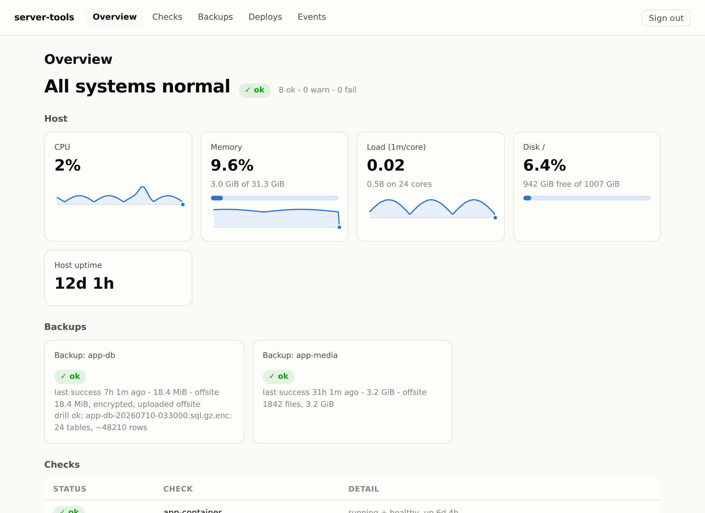
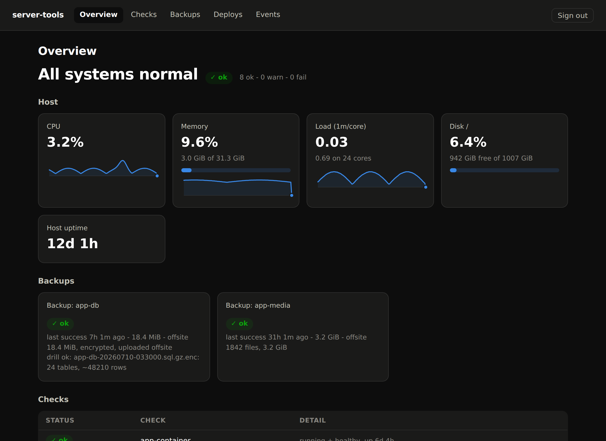
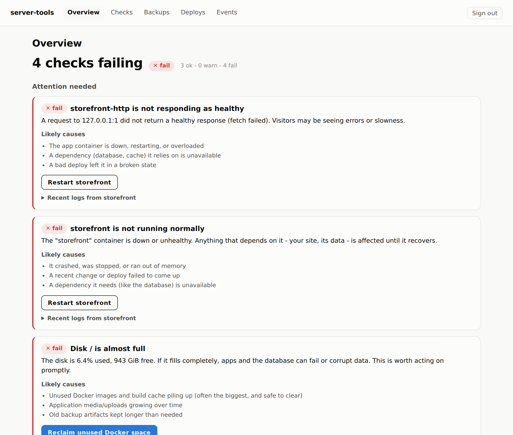
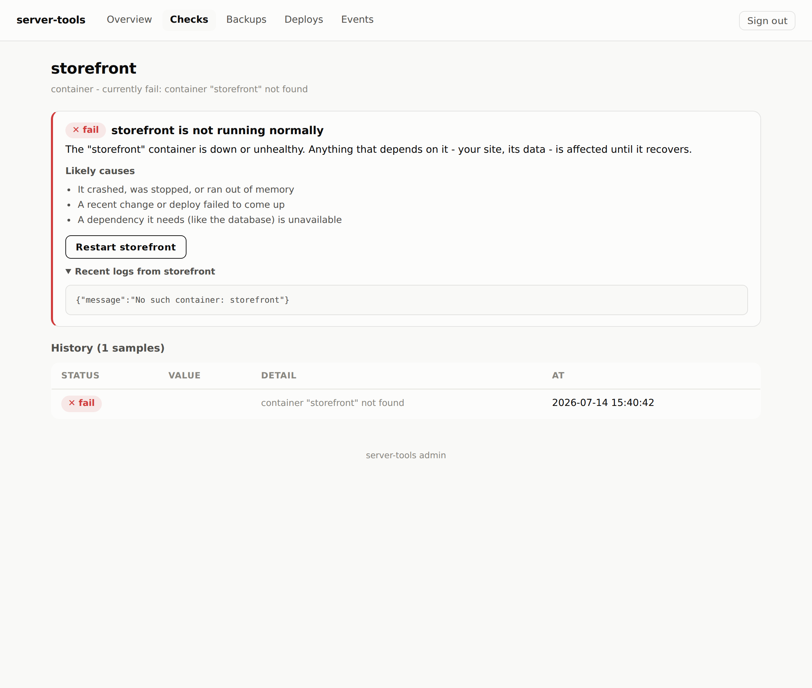
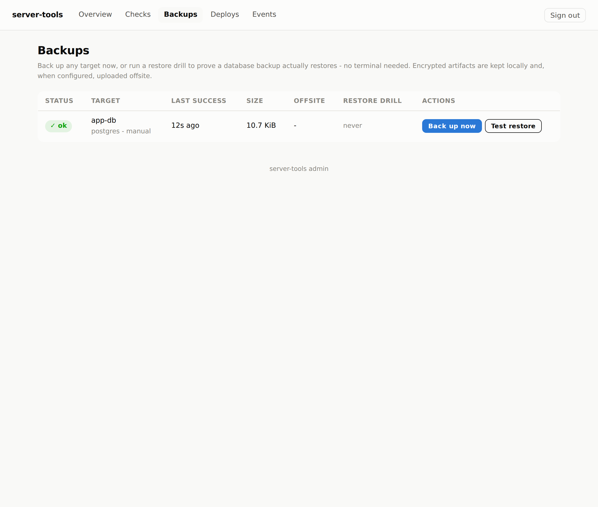
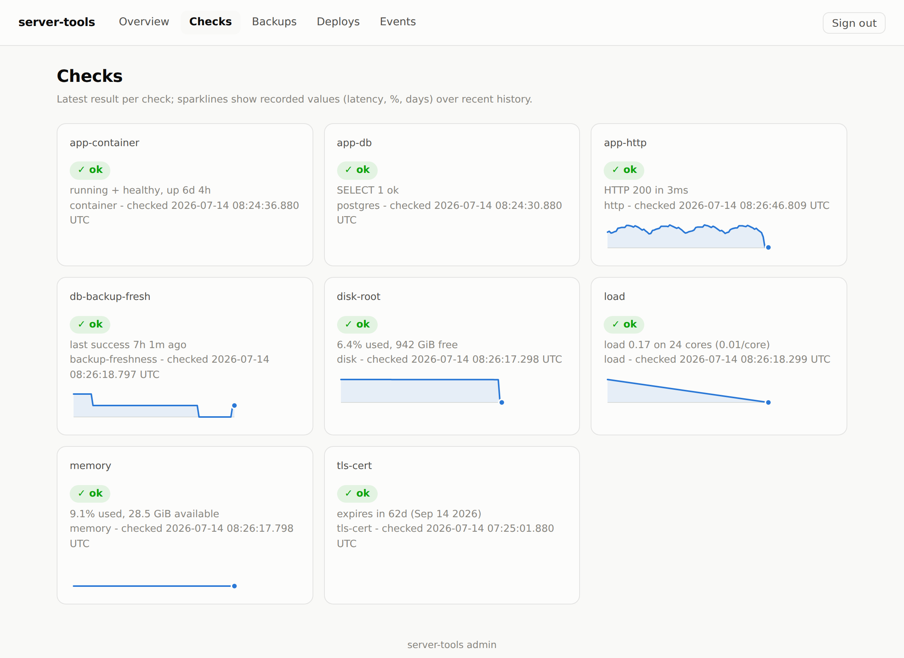
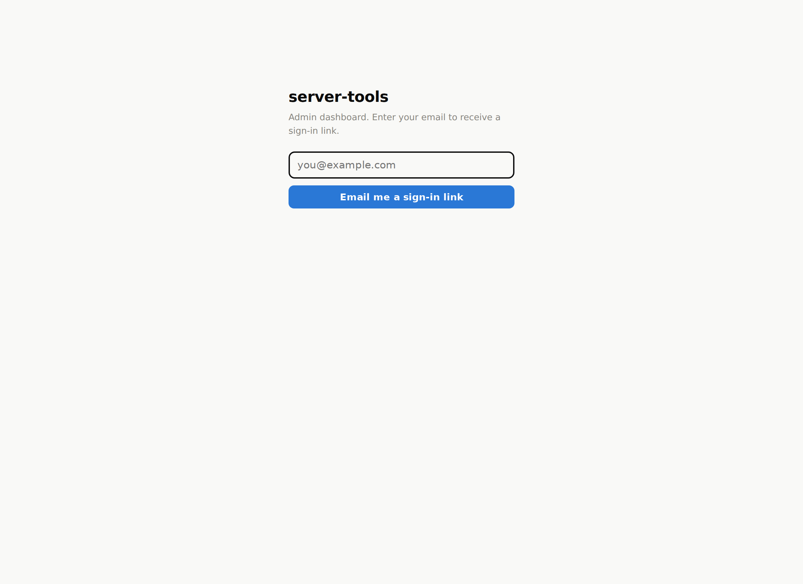

# server-tools

A self-contained operations toolkit for a single-box Docker VPS. One small
agent watches your applications, backs up their databases (encrypted,
offsite), deploys new releases safely with automatic rollback, cleans up after
itself, and serves an admin dashboard you can put behind your reverse proxy.

Built for the common self-hosting shape: a Linux box, Docker Compose, one or
more web applications, a Postgres container per app, and a reverse proxy such
as Caddy or nginx in front. Zero runtime npm dependencies: the only thing the
agent trusts is Node itself.

## What it does

| Area | What you get |
| --- | --- |
| Health checks | HTTP (status/latency/JSON assertions), TCP, TLS cert expiry, disk, memory, load, container health, Postgres liveness, backup freshness, arbitrary in-container commands |
| Alerting | Email (built-in SMTP client) and/or webhook (generic JSON or Discord-style); alerts fire on state change with a consecutive-failure threshold, and again on recovery |
| Backups | Scheduled `pg_dump` streamed through gzip + AES-256-GCM, kept locally and optionally uploaded to any S3-compatible bucket; grandfather-father-son retention; file-tree manifests with integrity verification for media directories |
| Restore | One-command restore, plus a `drill` command that restores the latest artifact into a scratch database and validates it, so you find out your backups work before you need them |
| Deploys | `server-tools deploy <app> <tag>`: fetch, checkout, rebuild, health-verify, and roll back automatically if the new version does not come up healthy |
| Housekeeping | Prunes its own history, expires temp files, age-based cleanup of directories you configure |
| Incident cards | Every failing check becomes a plain-language card: what it means, the likely causes (with live detail like reclaimable disk space and recent container logs), and safe one-click fixes - restart a container, reclaim unused Docker space, run a backup now. No SSH, no jargon |
| Dashboard | Server-rendered admin portal: status tiles, host gauges, check history sparklines, backup/deploy/event views. Magic-link login (email or CLI-generated), long-lived device sessions |

## Screenshots

The overview: status headline, host tiles with sparklines and meters, backup
state (including the last restore drill), and every check at a glance - in
your OS's light or dark theme:





When something is wrong, the dashboard leads with an "Attention needed"
section: each failing check is explained in plain words, with likely causes
and safe one-click fixes - not just a red light:



Opening a failing check shows the same card plus recent container logs and the
value history, so you can see context without SSHing in:



The Backups page turns routine chores into buttons: back up any target now, or
run a restore drill that proves a database backup actually restores - no
terminal needed:



Per-check history with values over time, and the sign-in flow (magic links,
no passwords):





## Quick start (local)

```bash
git clone <this repo> && cd server-tools
cp deploy/config.example.json config.json   # edit for your box
export BACKUP_PASSPHRASE="$(openssl rand -base64 32)"   # store this somewhere safe!
node src/cli.js validate
node src/cli.js check          # run all checks once, print results
node src/agent.js              # start the scheduler + dashboard
```

For production deployment on a VPS (Docker Compose + reverse proxy), follow
[docs/DEPLOY.md](docs/DEPLOY.md) step by step.

## The pieces

```
src/
  agent.js        long-running scheduler + dashboard server
  cli.js          run anything by hand: checks, backups, restore, drill, deploy
  config.js       one JSON config file; secrets injected via ${ENV_VAR}
  checks.js       check runners + alert state machine
  alerts.js       smtp + webhook routing (fail-soft, best-effort)
  smtp.js         minimal SMTP client (STARTTLS/implicit TLS, AUTH)
  docker.js       Docker Engine API over the unix socket (no docker CLI needed)
  metrics.js      host cpu/mem/load/disk from /proc and statfs
  store.js        JSON state + JSONL history under dataDir (cat/jq friendly)
  backup/         pg_dump + files backup, encryption, S3 SigV4, retention,
                  restore, drill
  deploy.js       tag checkout + compose build + health gate + auto-rollback
  housekeep.js    history/temp/directory cleanup
  remediate.js    plain-language incident diagnosis + one-click safe actions
  web/            dashboard: http server, magic-link auth, UI, action routes
```

## What the toolkit assumes about your applications

The defaults model a conventional self-hosted web application; every
assumption is configurable per target:

- Each app runs under Docker Compose in a directory that is a git checkout;
  deploying a release means checking out a tag and running
  `docker compose up -d --build`.
- Each app exposes an HTTP health endpoint that returns 2xx when healthy
  (JSON bodies can be asserted on, but a bare 200 is enough).
- Databases are Postgres containers; backups run `pg_dump` inside the
  container via the Docker API, so nothing extra is installed on the host.
- Media/uploads live in a directory (or volume mount) on the box.

Applications that hold end-to-end-encrypted content stay encrypted: backups
copy bytes as they are, and the dashboard only ever shows counts, sizes, and
statuses - never application content.

## Documentation

- [docs/DEPLOY.md](docs/DEPLOY.md) - step-by-step VPS deployment, reverse
  proxy wiring, first login
- [docs/CONFIG.md](docs/CONFIG.md) - every config field, with examples
- [docs/RUNBOOK.md](docs/RUNBOOK.md) - restore procedures, drills, incident
  basics
- [docs/SECURITY.md](docs/SECURITY.md) - auth model, secret handling, what
  the agent can touch

## Development

```bash
node --test              # unit tests
node src/cli.js validate # config sanity
```

CI runs the test suite on Node 20 and 22 plus a syntax pass over every module
and a validation of the example config.
